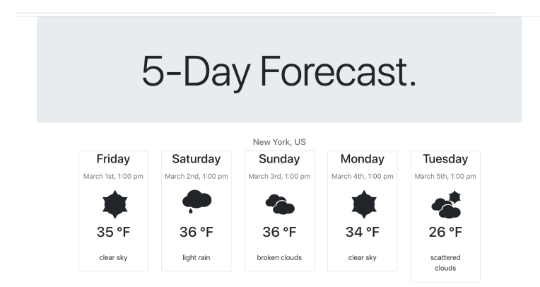

# 5 Day Forcast Assignment

Today you will be creating the following application.

You have until tomorrow at 9 am to complete this project, to begin fork this repository and clone it locally.

To turn the project in, create a PULL request.

You are allowed to use any resources you have in your posession. However, you are not allowed to ask other ***employees / students / tutors*** for assistant in this project.

## Libraries
You will be required to add the following libraries and APIs in your project

* [Open Weather API] (https://openweathermap.org/)
* [BootStrap] (https://getbootstrap.com/)
* [Weather Icons](https://erikflowers.github.io/weather-icons/)

## Bonus
* Add unit testing

## Available Scripts

In the project directory, you can run:

### `npm start`

